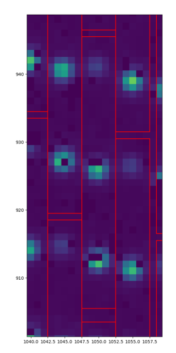
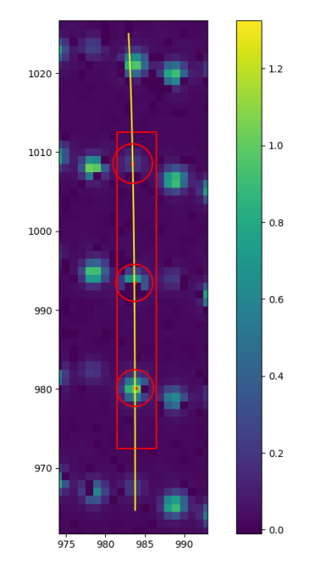
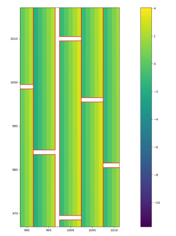
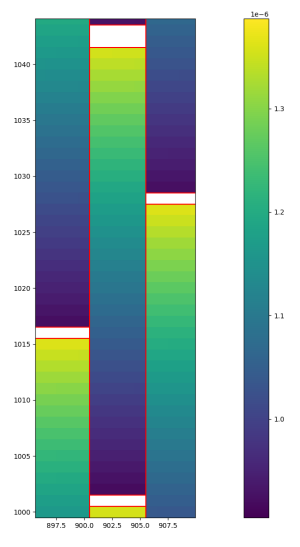
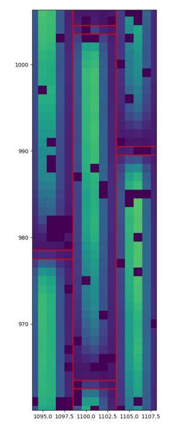
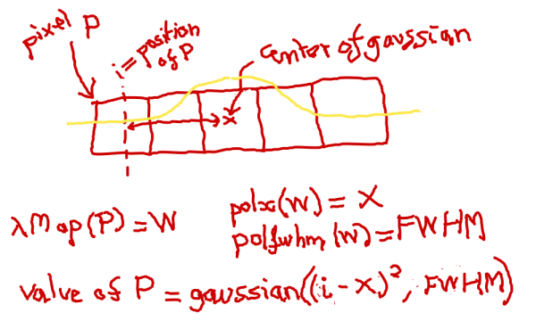
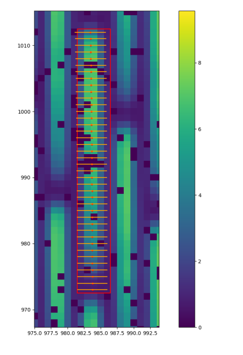

# PIC.jl

This package fits two models for PIC: the WaveLamp and the SpecPos. Each lenslet is treated
independently.

First, WaveLamp is fitted, then SpecPos is fitted using some output from the WaveLamp fit.

The data is a 2048x2048 matrix, and each lenslet data is a small 5x40 box inside it.
Boxes should not overlap (or only one column/line in common).

## Launching and reading results

You can read the test files "test/antoine-test.jl" and "test/antoine-test-yjh.jl" to find how to
use the package.

Most of the functions in the package, including non-exported ones, are documented.

The file "test/check-results.jl" contains methods to write a result in a fits file, to compare two
results, and to print a summary of a result.

The file "doc/script_for_images.jl" contains methods used to produce the images of the current
document, it is using PyPlot, it could be helpful to debug your results.

## Explanations on the method

### WaveLamp fit

The wavelamp data consists of 3 lasers that are projected on the lens box. For YJH mode there is 4
lasers.

Detail of a wavelamp lenslet box:

For the model, we consider the centers of the laser gaussian spots. We use a polynome for the x
position of the centers, the variable being the wavelength. Note that we already know the wavelength
of each laser. The degree of the polynome is set to the number of lasers minus one.\
We then have another polynome for the y position.\
Finally, we have a vector containing the FWHM for each spot.

The amplitudes and the common background level are *not* guessed parameters. We compute them from
the set of parameters listed above. Indeed we are able to compute the "best" values for these
parameters, i.e such that the derived cost function is zero at these points. Proof:

- We use Weighted Least Squares (WLS) as the cost function
- Recall that WLS is the sum of `(data - model)² * weights` (with pixel-wise operations).
- Let us write it in a matrix-vector way.
- Let `d` be the data vector `Nx1` (flatten the matrix if needed).
- Let `C` be the number of gaussians.
- Let `gi` be the ith gaussian model vector Nx1, with amplitude `1` and background `0`.
- Let `G` be a matrix `Nx(C+1)`, with the first column filled with `1`, and second column filled
  with `g1`, third column filled with `g2`, etc.
- Let `p` be a vector `(C+1)x1 = [β, α1, α2...]`, with `β` the variable for background and `αi` the
  variable for the amplitude of the ith gaussian.
- Let `W` be a matrix `NxN`, a diagonal matrix containing the weights.
- Then the WLS can be written:  `(d - Gp)ᵀ W (d - Gp)`
- Unfolding this expression gives:  `dᵀWd - 2pᵀGᵀWd + pᵀGᵀWGp`
- Deriving this WLS expression by `p`, gives:  `-2GᵀWd + 2GᵀWGp`
- When the WLS derived by `p` is zero, it implies that:   `GᵀWGp = GᵀWd`
- We isolate `p`:   `p = (GᵀWG)⁻¹ GᵀWd   = [β, α1, α2...]`

Detail of a wavelamp lenslet fit:

#### Distance Map and λMap

Note that with the two fitted polynomes for x and y positions, we are able to produce the gaussian
center for every wavelength (in the range of the instrument). In other words, we only had 3 or 4
lasers but we can now extrapolate the centers of the other wavelengths.

For the box of each lenslet, we produce two matrices (of the same size of the box):

- the distance map, where each pixel contains the distance to the closest gaussian center
- the λ map, where each pixel contains the wavelength corresponding to the closest gaussian center

Maybe this is too much hassle and the x value does not matter or almost never matter to determine
the closest center. Maybe we should define closest wavelength for the whole line, to be
investigated.

Detail of a distance map lenslet box:

Detail of a λ map lenslet box:

### SpecPos fit

The specpos data consists of a big part of the wavelength IFS range spectra projected on the lens
box.

Detail of a specpos lenslet box:

For the model, we consider that each pixel of the lenslet box comes from a 1D gaussian. From the 
λMap we have an associated wavelength for each pixel. We use a polynome for the x positions of the
centers of the gaussians, and a polynome for the fwhm of the gaussians, both polynomes being
variable of the wavelength. The degree of the polynomes can be set by user and the default is 2.

For a pixel P at line L, we find the associated wavelength W in the λMap, we then use the polynomes
with W as value of the variable, to find the center X of the 1D gaussian, and its FWHM. We then
compute the value of the 1D gaussian for the position of the pixel P.

Scheme for one example line of a lens box:

Be careful that every pixel has its own gaussian. But as said in the "Distance Map and λMap" part,
we suspect that the same (or very almost the same) gaussian center (and fwhm) will be seen for
every pixel of the same line.

As for WaveLamp, the amplitudes and the background are not part of the guessed parameters but
computed from the others, in a very similar manner. We use WLS cost again.

Detail of a scecpos lenslet fit:

Note: only the gaussian centers and fwhms from the central column of the box are displayed on this
graph.

